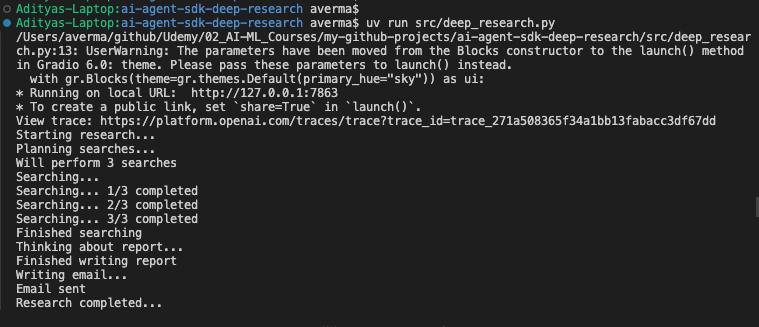
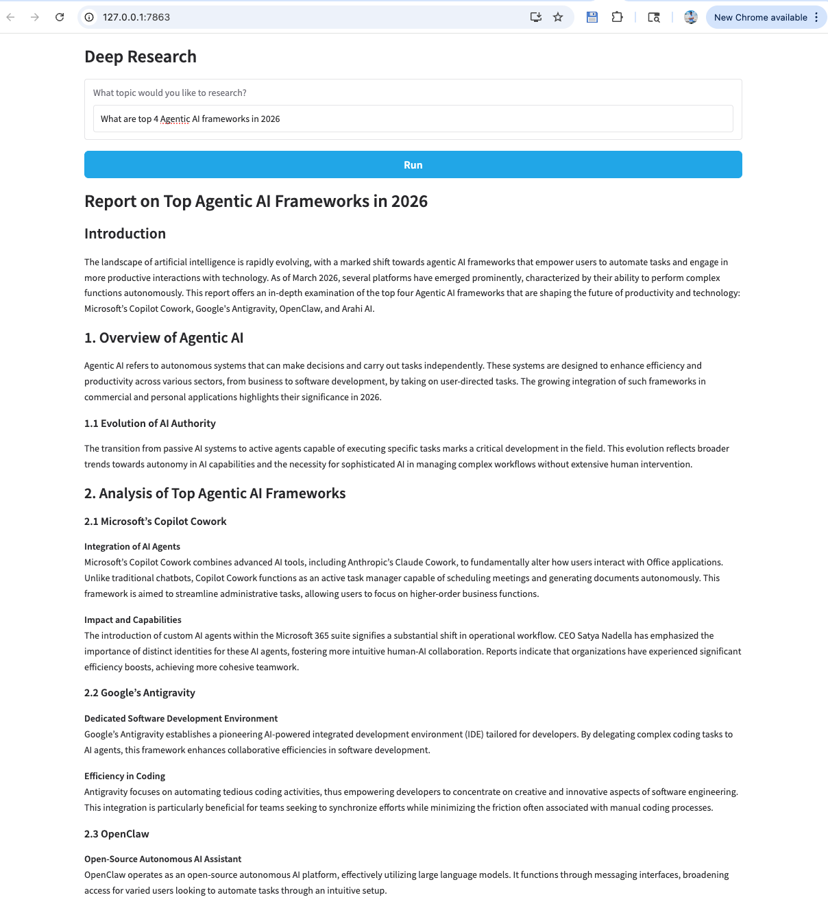

## Demo: Running the Deep Research App

This document walks through how to run the demo app, what happens in the terminal, what you see in the browser UI, and how the final report and email are produced.

---

### 1. Run the app from the terminal

From the project root:

```bash
uv run src/deep_research.py
```

You should see output similar to:

```text
* Running on local URL:  http://127.0.0.1:7863
* To create a public link, set `share=True` in `launch()`.
View trace: https://platform.openai.com/traces/trace?trace_id=...
Starting research...
Planning searches...
Will perform 3 searches
Searching...
Searching... 1/3 completed
Searching... 2/3 completed
Searching... 3/3 completed
Finished searching
Thinking about report...
Finished writing report
Writing email...
Email sent
Research completed...
```
Updated terminal snapshot from the same run:



This shows:

- **Gradio server** starting on `http://127.0.0.1:7863`.
- A **trace URL** you can open in the OpenAI Platform to inspect the full run.
- High-level **status messages** from `ResearchManager` as it plans searches, runs them, writes the report, sends the email, and finishes.


---

### 2. Open the browser UI

Open the local URL shown in the terminal (for example `http://127.0.0.1:7863`).  
You will see a page like this:


Updated UI example with a real deep-research run:




The UI (defined in `src/deep_research.py`) contains:

- A **textbox**: “What topic would you like to research?”
- A **Run** button.
- A **markdown area** where the streamed report and status messages appear.

---

### 3. Trigger a deep research run

1. Type a query into the textbox, e.g.  
   `What are top 4 Agentic AI frameworks in 2026`
2. Click **Run**.

Under the hood:

- The Gradio UI calls `run(query)` in `deep_research.py`.
- `run(query)` uses `ResearchManager().run(query)` as an **async generator**, streaming text chunks back to Gradio.
- Gradio displays these chunks (status + final report) in the markdown area.

You will see status lines like “Searches planned…”, “Searches complete…”, “Report written…”, and finally the full markdown report rendered on screen.

---

### 4. What happens behind the scenes

`ResearchManager` (in `src/research_manager.py`) orchestrates the full workflow:

1. **Trace setup**
   - Generates a `trace_id` and wraps the run in `with trace("Research trace", trace_id=trace_id):`.
   - Prints a “View trace” URL, which matches what you see in the terminal.

2. **Plan searches**
   - Calls `Runner.run(planner_agent, ...)` to get a `WebSearchPlan` with several `WebSearchItem` entries.

3. **Perform searches (async / parallel)**
   - Uses `asyncio.create_task` and `asyncio.as_completed` to run multiple calls to `search_agent` concurrently.
   - Streams progress updates like `Searching... 1/3 completed` to the terminal and UI.

4. **Write the report**
   - Calls `Runner.run(writer_agent, ...)` with the original query and summarized search results.
   - Receives a `ReportData` object containing `markdown_report`, which is streamed back to the UI at the end.

5. **Send the email**
   - Calls `Runner.run(email_agent, report.markdown_report)`.
   - `email_agent` uses the `send_email` tool (in `src/email_agent.py`) and SendGrid to send a nicely formatted HTML email with the report content.
   - The terminal prints “Writing email...” and then “Email sent”.

6. **Finish run**
   - `ResearchManager.run` yields “Research complete” and the final markdown report, which Gradio renders as the long, structured report you see in the browser (sections, headings, etc.).

---

### 5. End-to-end experience recap

- **Terminal**: start the app with `uv run src/deep_research.py`, watch the high-level progress and grab the trace URL.
- **Browser**: open the local Gradio URL, enter a question, press Run, and watch status + report stream into the page.
- **Tracing & email**: inspect the detailed trace in the OpenAI Platform, and check your inbox for the HTML email sent by `email_agent` with the same report content.

