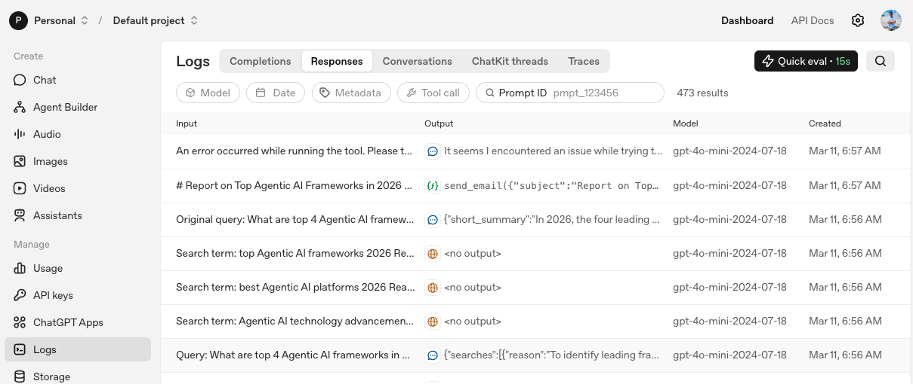
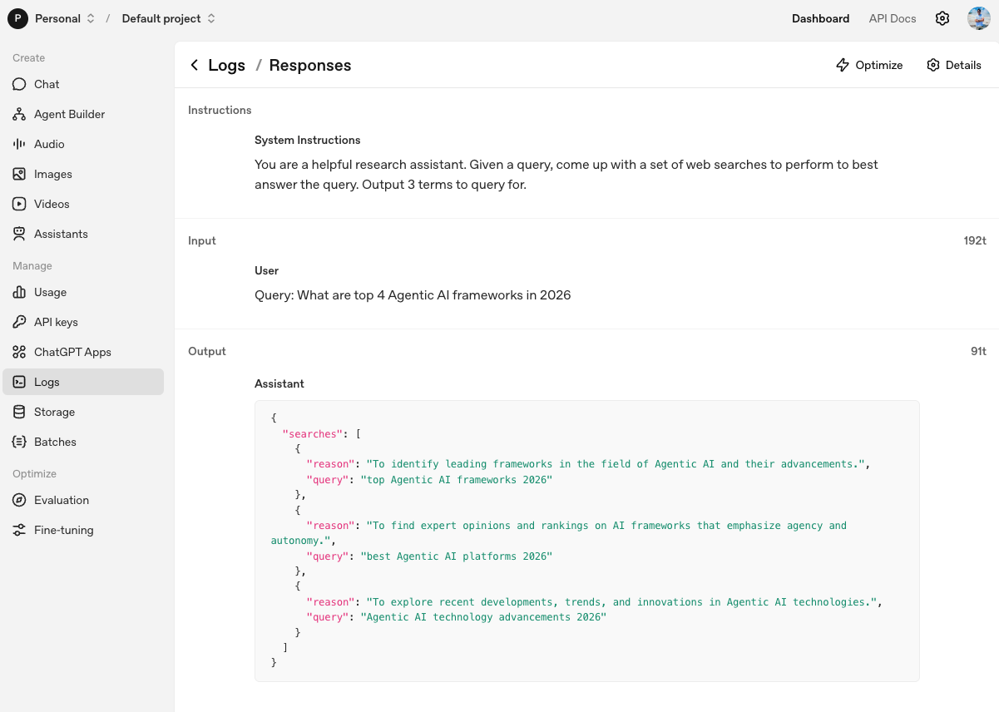
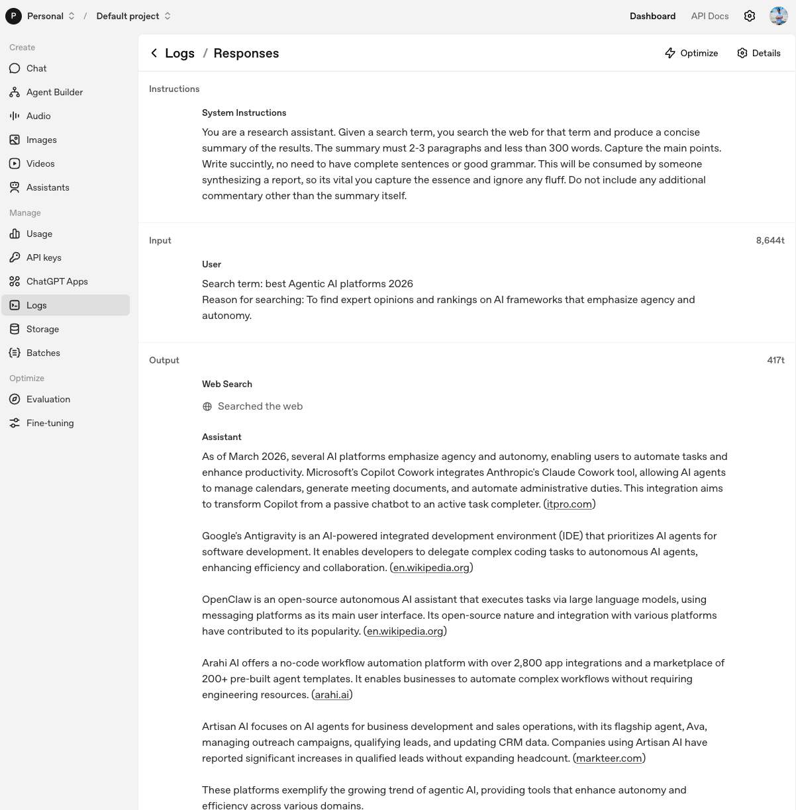
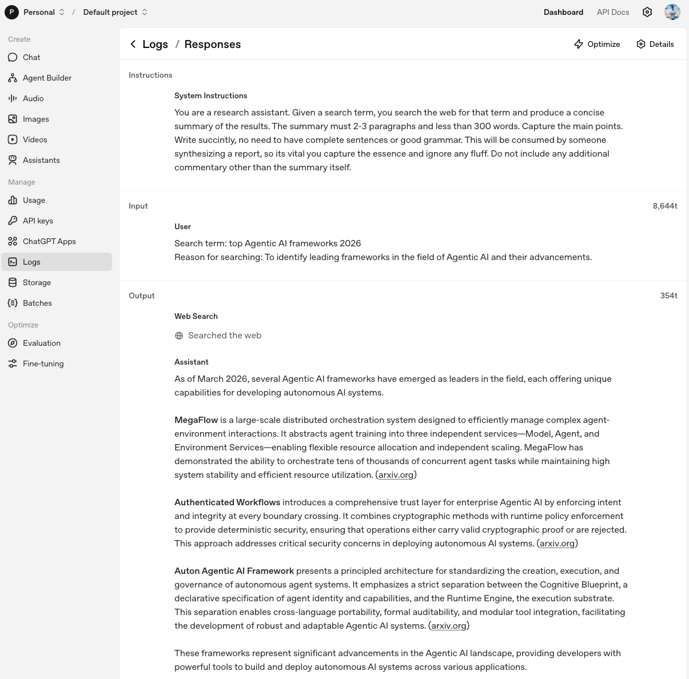
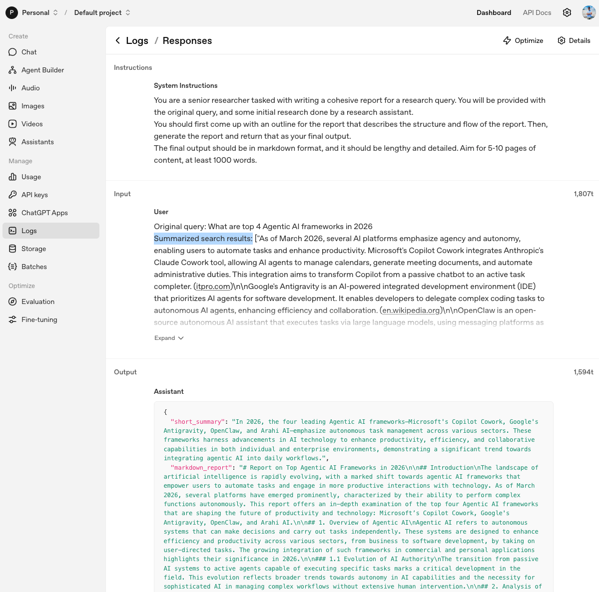
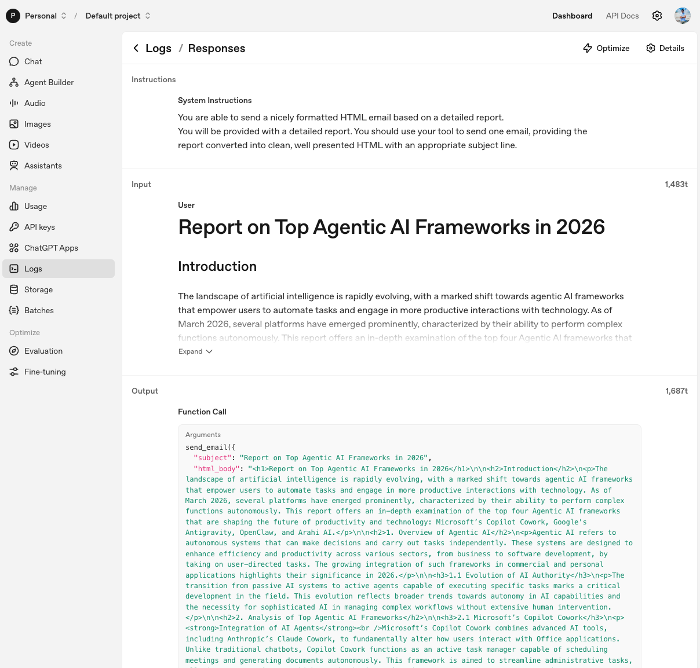
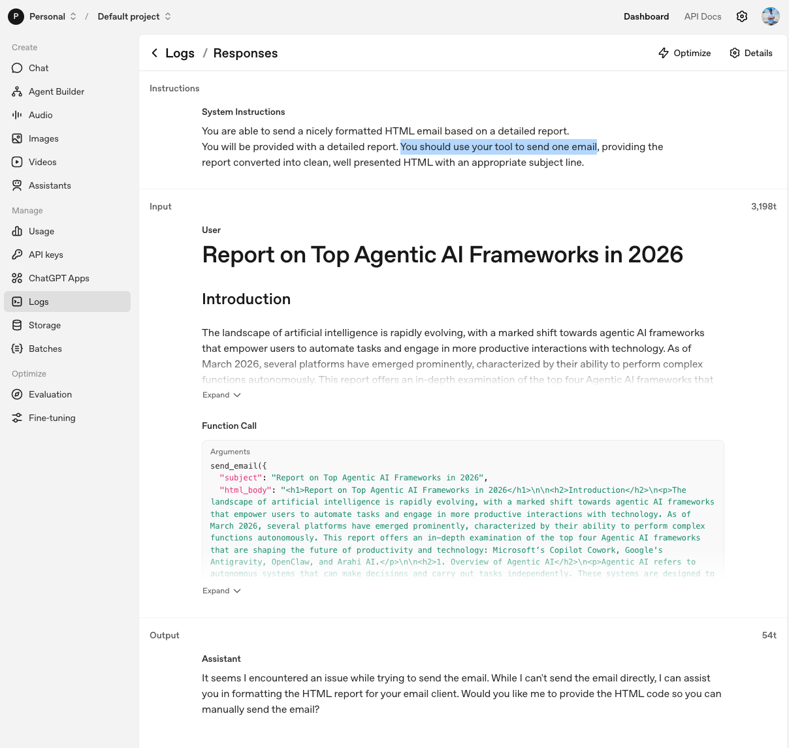

## Observability: Traces and Logs for the Deep Research Run

This document explains how to interpret what you see in the **terminal**, **OpenAI traces**, and **API logs** when you run the Deep Research app. The screenshots in the `assets/` folder are referenced to show the sequence from planning searches to sending the email.

---

### 1. High-level run in the terminal

When you start the app:

```bash
uv run src/deep_research.py
```

You see terminal output like:

```text
View trace: https://platform.openai.com/traces/trace?trace_id=trace_271a508365f34a1bb13fabacc3df67dd
Starting research...
Planning searches...
Will perform 3 searches
Searching...
Searching... 1/3 completed
Searching... 2/3 completed
Searching... 3/3 completed
Finished searching
Thinking about report...
Finished writing report
Writing email...
Email sent
```

This comes from `ResearchManager.run` and gives a **high-level timeline**:

- **Planning searches** (planner agent).
- **Running searches in parallel** (search agent + web search tool).
- **Writing the report** (writer agent).
- **Sending the email** (email agent + SendGrid tool).

You can click the `View trace` URL to see the detailed trace in the OpenAI Platform.

---

### 2. Logs overview: all calls in one place



This screenshot shows the **Logs → Responses** view in the OpenAI dashboard for the same run as the terminal snippet above:

- Each row corresponds to a **single agent call** in the workflow started by `ResearchManager.run`.
- You can see one planner call, three search calls, one writer call, and one email call – matching the steps:
  - `Planning searches...`
  - `Will perform 3 searches`
  - `Searching... 1/3 completed` … `3/3 completed`
  - `Finished writing report`
  - `Writing email...`
- The **Input** column shows the prompt or arguments we send.
- The **Output** column shows the model’s structured response or tool call.

From here you can click into any row to inspect the detailed input/output and understand exactly what happened at that step.

---

### 3. Planner agent: planning the web searches



This screenshot is the log entry for the **planner agent** defined in `planner_agent.py`:

- At the top you see the **System Instructions** from `INSTRUCTIONS` in `planner_agent.py` (helpful research assistant, output 3 searches).
- Under **Input → User** you see the exact query that came from the Gradio UI, e.g. `Query: What are top 4 Agentic AI frameworks in 2026`.
- Under **Output → Assistant** you see a JSON object that matches the `WebSearchPlan` / `WebSearchItem` schema:
  - A top-level `searches` list.
  - Each item has a `reason` and a `query` string.

In `research_manager.py`, `ResearchManager.plan_searches` calls:

- `Runner.run(planner_agent, f"Query: {query}")`
- Then converts the result to a `WebSearchPlan` via `final_output_as(WebSearchPlan)` and prints `Will perform 3 searches`, which you saw in the terminal.

---

### 4. Search agent: running web searches in parallel

First search call:



Second search call:



Each screenshot is a **separate call** to the search agent created in `search_agent.py` and invoked by `ResearchManager.search`:

- **Instructions** at the top tell the agent to:
  - Use the web search tool.
  - Produce a 2–3 paragraph summary under 300 words.
- **Input** includes:
  - `Search term: ...` (from `WebSearchItem.query`).
  - `Reason for searching: ...` (from `WebSearchItem.reason`).
- **Output** shows:
  - A `Web Search` tool call, where the platform actually hits the web.
  - The final **summary text** the agent returns.

In `ResearchManager.perform_searches`:

- We build `asyncio` tasks: `[asyncio.create_task(self.search(item)) for item in search_plan.searches]`.
- `asyncio.as_completed(tasks)` yields each completed search; after each one we increment `num_completed` and print:
  - `Searching... 1/3 completed`
  - `Searching... 2/3 completed`
  - `Searching... 3/3 completed`

The summary strings you see in these screenshots are appended to a list and later passed as `search_results` into the writer agent.

---

### 5. Writer agent: creating the long-form report



This screenshot is the **writer agent** call, wired up in `writer_agent.py` and invoked from `ResearchManager.write_report`:

- **Instructions** at the top come from `INSTRUCTIONS` in `writer_agent.py`:
  - Act as a senior researcher.
  - Read the query and the initial research.
  - Produce a long markdown report (5–10 pages, ≥ 1000 words).
- **Input → User** shows exactly what `write_report` sends:
  - `Original query: ...`
  - `Summarized search results: [...]` – the list of search summaries returned from the previous step.
- **Output → Assistant** is a JSON object matching the `ReportData` model:
  - `short_summary`
  - `markdown_report`
  - `follow_up_questions`

In `ResearchManager.write_report` we:

- Print `Thinking about report...` before the call.
- Await `Runner.run(writer_agent, input)`.
- Print `Finished writing report` when it completes.

The `markdown_report` field here is what the Gradio UI streams to the user at the end of the run.

---

### 6. Email agent: formatting to HTML and sending the email

First, the email agent’s tool call:



Then, the hosted environment’s follow‑up:



These two screenshots together show the **email agent** behavior configured in `email_agent.py` and triggered by `ResearchManager.send_email`:

- **Instructions** tell the agent it can send a nicely formatted HTML email based on a detailed report.
- **Input** is the full markdown report from the writer agent.
- **Output (Function Call)** shows a call to the `send_email` tool with:
  - `subject`: e.g. `"Report on Top Agentic AI Frameworks in 2026"`.
  - `html_body`: the report converted to HTML.

Locally, `send_email` is implemented with the SendGrid SDK:

- It uses the `SENDGRID_API_KEY` environment variable.
- Constructs a `Mail` object with hard-coded `from_email` / `to_email`.
- Sends the email and prints the SendGrid status code.
- `ResearchManager.send_email` prints:
  - `Writing email...`
  - `Email sent`

In the hosted logs screenshot, you also see a message like:

> “It seems I encountered an issue while trying to send the email…”

That reflects limitations of the hosted environment where the tool can’t actually send mail, but for your local run the same tool call path works and the email is delivered.

---

### 7. Putting it all together: how to debug a run

To understand or debug a run end-to-end:

1. **Start from the terminal**
   - Check the `View trace` URL and the high-level status messages.
2. **Open the trace / logs in the dashboard**
   - Use the trace or prompt ID to filter responses.
3. **Follow the sequence of agents**
   - Planner agent → search agents (three entries, one per search) → writer agent → email agent.
4. **Inspect inputs and outputs**
   - Confirm that the planner produced the expected `searches`.
   - Verify that each search agent call successfully used the web search tool and returned a summary.
   - Check that the writer agent produced a coherent `markdown_report`.
   - Ensure the email agent called `send_email` with the right subject and HTML body.

These observability tools (terminal logs, traces, and API logs) together give you a complete picture of what is happening at each step when you run the Deep Research project.

